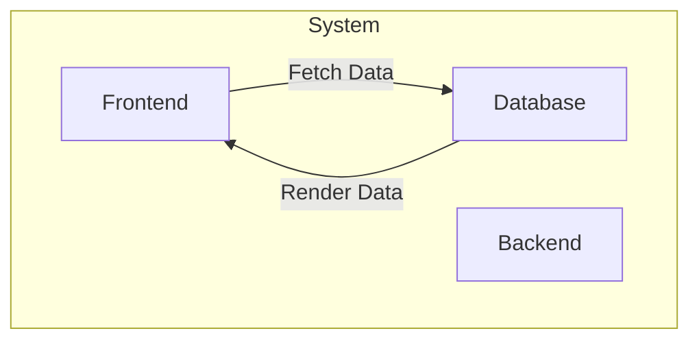
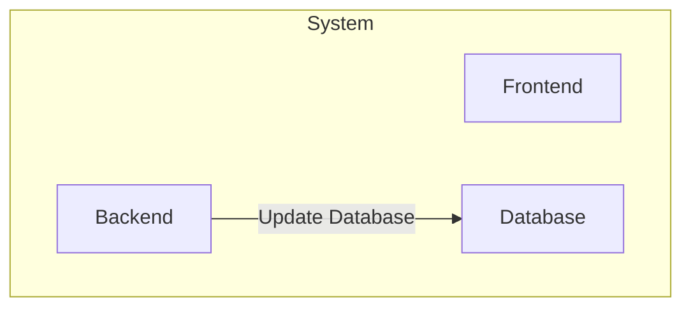
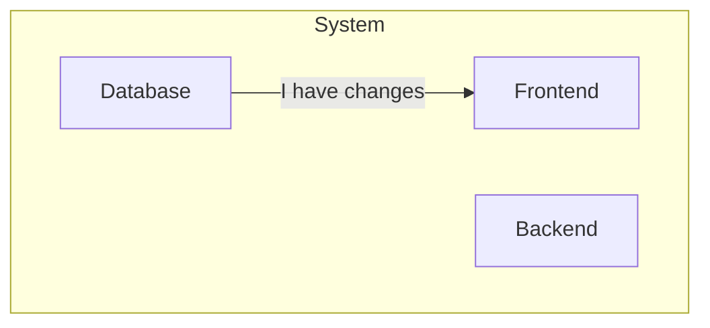
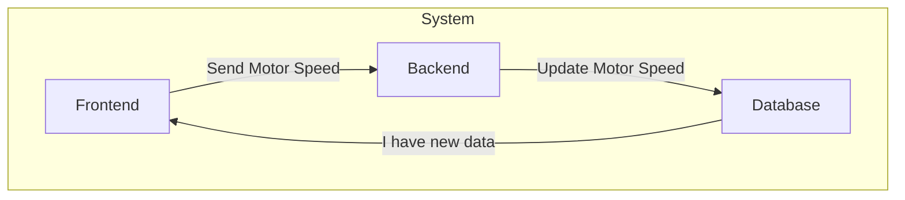
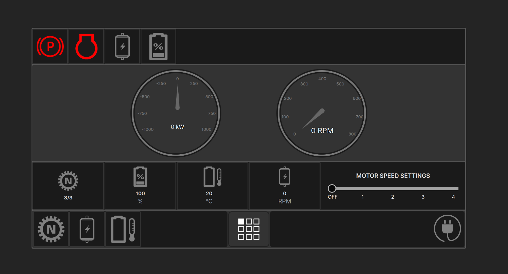
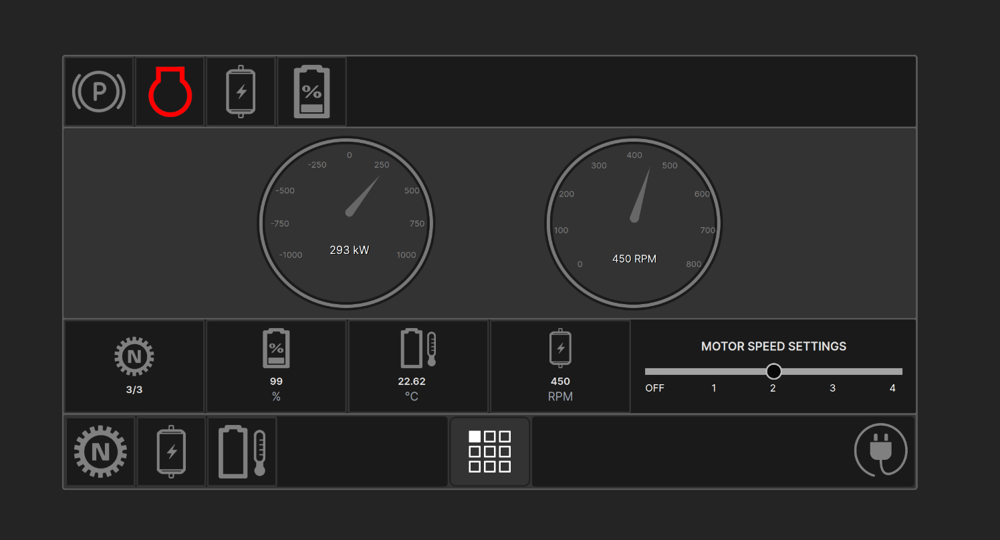
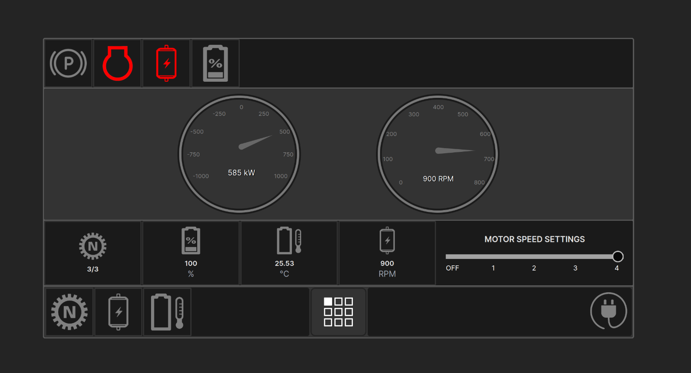
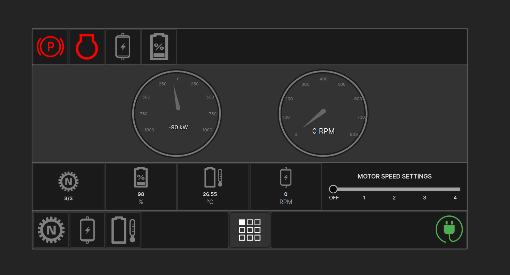

# Vehicle Dashboard

[](https://hits.sh/github.com/vmsaif/vehicle-dashboard/)


A real-time vehicle dashboard built with React, Express, and PostgreSQL. The dashboard displays telemetry data from a database and allows users to interact with the vehicle settings through API endpoints.

The database has values which are used to render on the frontend.

# Static Website Link:
[Vehicle Dashboard (https://saifmahmud.dev/vehicle-dashboard-static-frontend/)](https://saifmahmud.dev/vehicle-dashboard-static-frontend/)

# Backend Console is rendered on the browser:
[Vehicle Dashboard Backend Console (https://vehicle-dashboard.mahmudsaif-aws.us/)](https://vehicle-dashboard.mahmudsaif-aws.us/)

## Tech Stack

| **Layer**             | **Technology**                 | **Purpose**                                  |
|-----------------------|--------------------------------|----------------------------------------------|
| **Frontend**          | React with Vite                | Interactive UI for the dashboard             |
| **Styling**           | Tailwind CSS                   | Modern design                                |
| **Backend**           | Express.js + WebSocket         | API and WebSocket real-time communication    |
| **Database**          | PostgreSQL With Supabase       | Relational database for telemetry data       |
| **Frontend Hosting**  | GitHub Pages                   | Host the React app                           |
| **Backend Hosting**   | Amazon AWS EC2 instance        | Host WebSocket, express.js backend           |
| **Database Hosting**  | Supabase                       | PostgreSQL instance                          |
| **Version Control**   | GitHub                         | Code repository                              |
| **Deployment CI/CD**  | GitHub Actions                 | Automate build and deployment workflows      |

## Diagrams

### System Overview

First, the frontend fetches data from the database using API endpoints managed by the backend. The backend updates the database when the user interacts with the vehicle settings. The database sends real-time updates to the frontend.

#### Diag 1:


The API endpoints are managed by the backend. When the user uses API endpoints to interact with the vehicle settings, The backend updates the database.

#### Diag 2:


After the database is updated, it sends a real-time update to the frontend using a WebSocket connection.

#### Diag 3:


Then the frontend updates the UI with the new data.

The only input field on the frontend is the motor speed settings. When the user changes the motor speed settings, the frontend sends the new value to the backend, which updates the motor RPM in the database in real-time.

#### Diag 4:


#### Diag 5:


<!-- Installation -->
## Installation

### Prerequisites
- NVM (Node Version Manager)
- Node.js
- git
- tailwindcss

#### Install nvm
```bash
curl -o- https://raw.githubusercontent.com/nvm-sh/nvm/v0.39.3/install.sh | bash
```
:bulb: *Note: After installing NVM, close the terminal and open a new one to use NVM.*

#### Install and use Node.js
```bash
nvm install node
nvm use node
```

### Clone the repository
```bash
git clone https://github.com/vmsaif/vehicle-dashboard.git
cd vehicle-dashboard
```

### Install dependencies

#### FRONTEND
```bash
cd frontend
npm install
```

#### Create a .env file in the frontend directory and add the following line

```bash
echo "VITE_BACKEND_URL=http://localhost:3001 \nVITE_SUPABASE_URL= \nVITE_SUPABASE_SERVICE_KEY" > .env
```
Replace the `http://localhost:3001` with the backend URL

#### Run the frontend
```bash
npm run dev
```

#### BACKEND

```bash
cd ../backend
npm install
```
#### Create a .env file in the backend directory and add the following line

```bash
echo -e "SERVER_URL= \nSERVER_PORT= \nSUPABASE_URL= \nSUPABASE_SERVICE_KEY= " > .env
```

Replace the `SUPABASE_URL`, `SUPABASE_SERVICE_KEY`, `SERVER_URL`, and `SERVER_PORT` with the appropriate values.

#### Run the backend
```bash
npm start
```

### Usage
Please refer to the [usage documentation](docs/usage.md) for detailed instructions on how to use the dashboard.

### Screenshots

#### App Overview


#### Motor ON


#### High RPM


#### Charging ON


## Assets and Resources
- Extracted Icons from the provided PDF.
- Used online photo editor tool to clean up the icons - [Photopea](https://www.photopea.com/)
- Vectorized the icons using [Vector Magic](https://vectormagic.com/)

